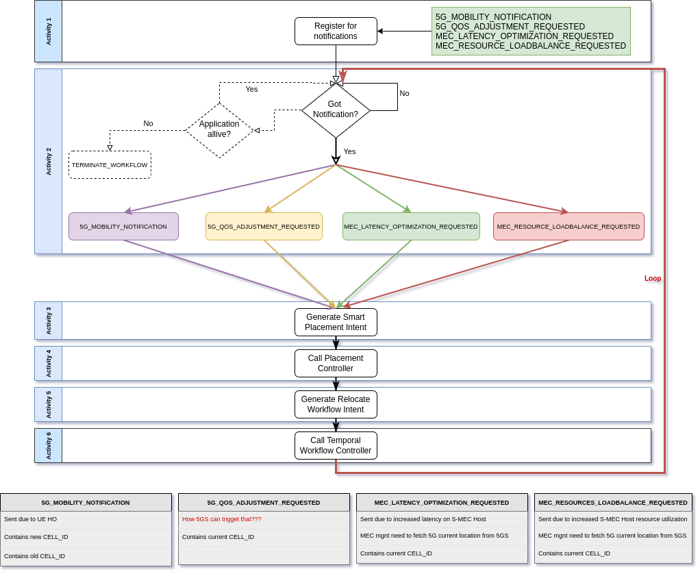

Life-Cycle Management Workflow (lcm-workflow)
---

## Design

`Life-Cycle Management Workflow` is composed of 2 microservices: (I) `workflow worker` and (II) `workflow client`.
Both microservices should be able to communicate with `Temporal Server`, based on endpoint provided via 
helm configuration (env variables).

- `Workflow Client` provides endpoint for `EMCO` to invoke *different* workflows. Then these workflows can be served
    by the instance of `Workflow Worker` which listens on given queue (here `LCM_TASK_Q`).
- `Workflow Worker` know how to serve the workflow, based on custom implementation. In worker definition, we have to
    explicitly register `Workflows` and `Activities`.

## Workflow and activities

Each `Workflow` is composed of set of activities. In the case of `Life-Cycle Management Workflow), we defined activities:

- `SubCellChangedNotification` - creates a subscription for the `CELL_CHANGED` notifications. 
- `GetCellChangedNotification` - creates the HTTP server, which listens for notifications until it receives one. 
    The listener URL is generated and saved in the previous activity.
- `GenerateSmartPlacementIntent` - creates Smart Placement Intent, based on received `CELL_ID` and information
    provided as the input for `lcm-workflow`.
- `CallPlacementController` - communicated with Smart Placement Controller. Controller (based on the Smart Placement
Intent) should return `OPTIMAL CLUSTER`, based on constraints and given `CELL_ID`.
- `GenerateRelocateWfIntent` - creates `Relocate Workflow Intent`, based on received `OPTIMAL CLUSTER` and information
    provided as the input for `lcm-workflow`.
- `CallTemporalWfController` - creates & invokes `Relocate Workflow` using `EMCO`.

## Usage of `Life-Cycle Managament Workflow`

Thanks to `EMCO TAC` controller we can define `Temporal Action Intent` for the given application, and make use of
`Workflow Hooks`. In this way, `Life-Cycle Management Workflow` can be started automatically after the application
instance have started.

Sample `TAC Intent`

```yaml
---
# Post install hook
version: emco/v2
resourceContext:
  anchor: projects/{{.ProjectName}}/composite-apps/{{.CompositeApp}}/v1/deployment-intent-groups/{{.DeploymentIntent}}/temporal-action-controller
metadata :
  name: {{ .AppName}}-lcm-workflow-intent
  description: "Post workflow install"
spec:
  hookType: "post-install"
  hookBlocking: true
  workflowClient:
    clientEndpointName: {{.WfClientEndpointName}}
    clientEndpointPort: {{.WfClientEndpointPort}}
  temporal:
    workflowClientName: {{.WfClientName}}
    workflowStartOptions:
      id: {{.WfID}}
      taskQueue: {{.WfTaskQueue}}
      retryPolicy:
        maximumAttempts: 1
    workflowParams:
      activityOptions:
        all-activities:
          startToCloseTimeout: 6000000000000
          heartbeatTimeout: 5000000000000
          retryPolicy:
            initialInterval: 10
      activityParams:
        all-activities:
          emcoOrchEndpoint: {{.WfEmcoOrch}}
          emcoOrchStatusEndpoint: {{.WfEmcoOrchStatus}}
          emcoClmEndpoint: {{.WfEmcoClm}}
          emcoWfMgrURL: "http://10.254.185.42:30495"
          project: {{.ProjectName}}
          compositeApp: {{.CompositeApp}}
          compositeAppVersion: v1
          deploymentIntentGroup: {{.DeploymentIntent}}
          targetAppName: {{.AppName}}
          appPriorityLevel: "critical"
          latencyMax: "6"
          cpuUtilizationMax: "93"
          memUtilizationMax: "93"
          latencyWeight: "0.5"
          cpuUtilizationWeight: "0.25"
          memUtilizationWeight: "0.25"
          innotUrl: {{ .InnotUrl }}
          plcControllerUrl: "http://10.254.185.44:32137/v1/plc-ctrl"
          rClientName: "10.254.185.27"
          rClientPort: "30102"
          rWfClientName: "relocate_workflowclient"
```

*Please NOTE that `probably` Intent definition needs to be refactored*

## Further work

The `lcm-workflow` can be extended to consider more than just one type of notification (relocation trigger). For example
we could consider such workflow (types of notifications are just examples):

